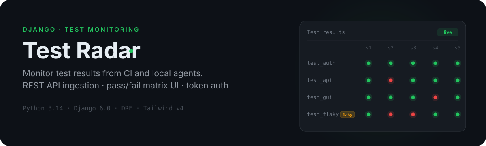
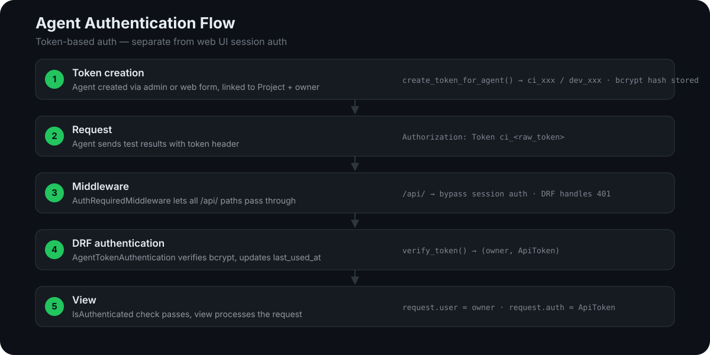

<!--
SPDX-FileCopyrightText: Copyright (c) 2025-2026 Almaz Ilaletdinov <a.ilaletdinov@yandex.ru>
SPDX-License-Identifier: MIT
-->

<p align="center">
  
</p>

Test Radar is a Django web application for monitoring and storing test results. It ingests results from CI and local agents via a REST API and displays them in a pass/fail matrix web interface.

## Key features

- **Projects** — each user sees only their own projects
- **Agents** — CI or local agents with API tokens for automatic result submission
- **Test records** — stores success/failure, zlib-compressed logs, git branch and commit
- **Pass/fail matrix** — project page shows labels × sessions grid with flaky-test detection
- **REST API** — `POST /api/v1/test_record/bulk_create/` for bulk result ingestion (up to 500 records per call)
- **Token auth** — bcrypt-hashed agent tokens (`ci_` / `dev_` prefix), separate from web sessions
- **i18n** — Russian and English

## Quick start

```bash
uv sync
```

Create a `.env` file:

```env
SECRET_KEY=your-secret-key
DEBUG=True
ALLOWED_HOSTS=localhost,127.0.0.1
REGISTRATION_ENABLED=True
```

Apply migrations and run:

```bash
uv run python src/manage.py migrate
uv run python src/manage.py runserver
```

The app will be available at `http://127.0.0.1:8000/`.

### Docker

```bash
task compose-setup    # build app image, pull postgres
task compose-run      # start services
```

## API

### Submit test results

```
POST /api/v1/test_record/bulk_create/
Authorization: Token ci_<raw_token>
```

**Payload:**

| Field | Type | Description |
|---|---|---|
| `session_id` | UUID | Get-or-creates a `TestSession` |
| `started_at` | datetime | Session start time |
| `environment` | object | `os`, `os_version`, `arch` |
| `context` | object | `branch`, `commit_hash` |
| `records` | list (1–500) | Each: `label`, `timestamp`, `logs` (base64), `success` |

## Agent authentication flow

<p align="center">
  
</p>

Agents authenticate via token-based auth, separate from the web UI session auth. The raw token is returned once at creation and never persisted in plaintext — only a bcrypt hash and a masked preview are stored.

<details>
<summary>Authentication details</summary>

- `AgentTokenAuthentication` reads the `Authorization: Token` header, filters `ApiToken` candidates by `token_mask__startswith`, skips expired tokens, and checks the raw token against each candidate's bcrypt hash
- On success: `request.user` = agent owner, `request.auth` = `ApiToken`
- On invalid token: DRF returns `401 {"detail": "Invalid agent token."}`
- `AuthRequiredMiddleware` allows all `/api/` paths to bypass session auth — DRF handles authentication and 401 responses
- `DEFAULT_PERMISSION_CLASSES = [IsAuthenticated]`

</details>

## Development

| Action | Command |
|---|---|
| Tests | `uv run pytest` |
| Lint | `uv run ruff check src && uv run flake8 src/` |
| Type check | `uv run mypy src/` |
| Format | `uv run ruff format src/` |
| Extract messages | `uv run django-admin makemessages -l ru -l en --no-location --no-wrap` (from `src/`) |
| Compile translations | `uv run django-admin compilemessages -l ru -l en` (from `src/`) |

## Tech stack

Python 3.14 · Django 6.0 · Django REST Framework · SQLite (dev) / PostgreSQL (prod) · Tailwind CSS v4 · pytest + pytest-django · Ruff + flake8 (wemake-python-styleguide) + mypy (django-stubs)

## Project structure

```
src/
├── server/          — Django settings, middleware, URL configuration
├── auth/            — custom User model, login/register forms
├── records/         — Project, Agent, ApiToken, TestSession, TestRecord models; services
├── gui/             — web interface (views + templates)
├── api/             — REST API (serializers, views)
├── locale/          — translation files (ru, en)
└── tests/           — integration (it/) and unit (unit/) tests
```

## License

MIT
