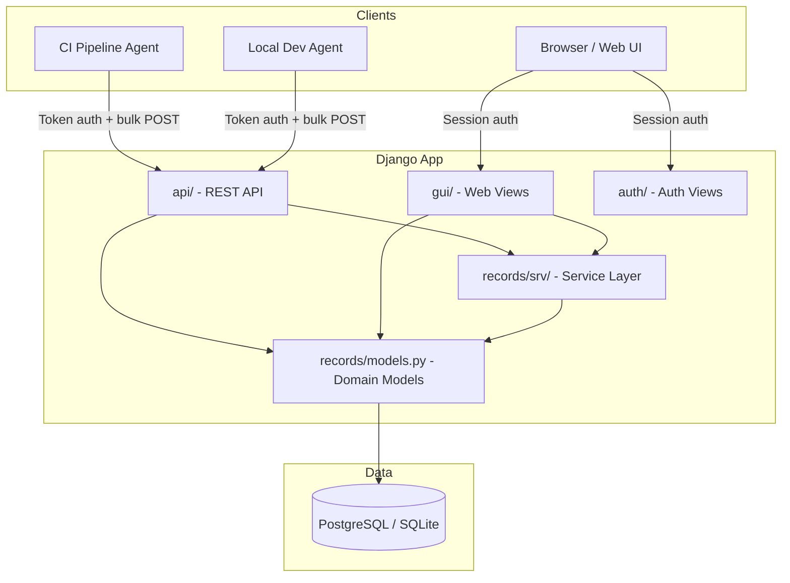
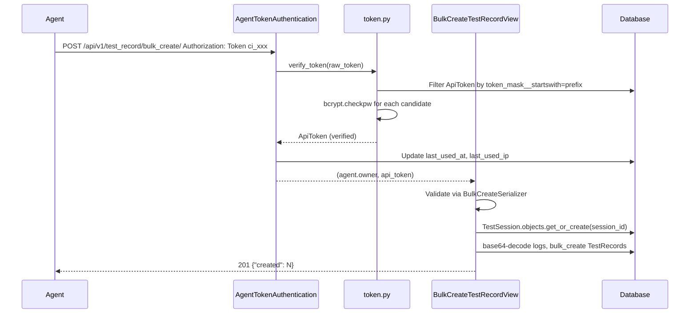
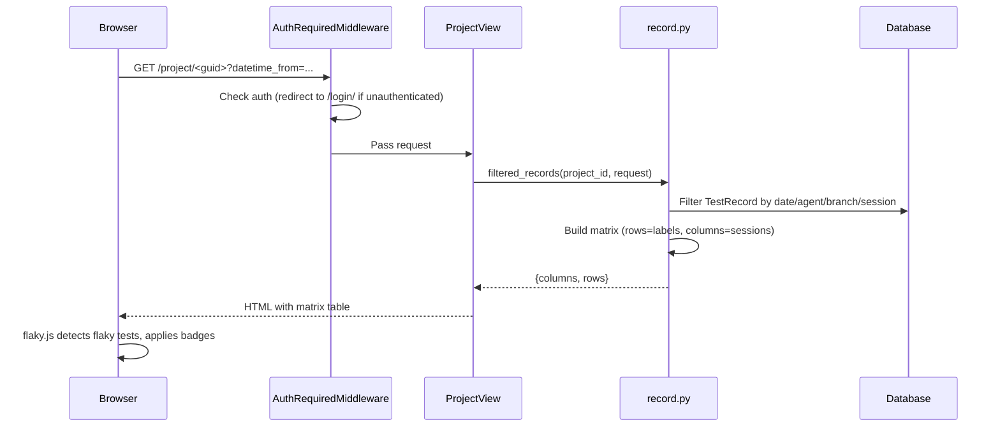
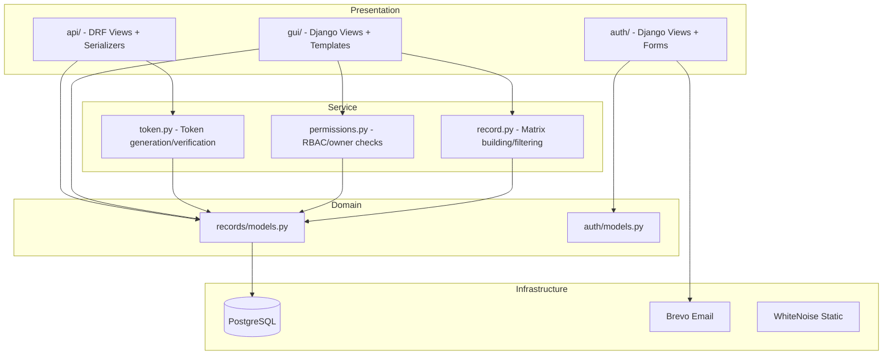

# Architecture

## Overview

Test Radar is a monolithic Django application with three main interfaces:

1. **REST API** (`api/`) — receives test results from agents
2. **Web UI** (`gui/`) — renders the pass/fail matrix and management pages
3. **Auth** (`auth/`) — user registration, login, email confirmation



## Request flow

### API: bulk test result submission



### Web UI: project matrix



## Domain model

```mermaid
erDiagram
    User ||--o{ Project : owns
    User ||--o{ Membership : has
    User ||--o{ Agent : owns
    Project ||--o{ Membership : has
    Project ||--o{ Agent : has
    Project ||--o{ TestSession : has
    Project ||--o{ TestRecord : has
    Agent ||--|| ApiToken : has
    Agent ||--o{ TestRecord : submits
    TestSession ||--o{ TestRecord : contains

    Project {
        uuid guid
        string name
        fk owner
        datetime created_at
    }
    Membership {
        fk user
        fk project
        enum role
    }
    Agent {
        string name
        enum type
        uuid guid
        fk project
        fk owner
    }
    ApiToken {
        string token_hash
        string token_mask
        string scopes
        datetime expires_at
        datetime last_used_at
        ip last_used_ip
    }
    TestSession {
        uuid id
        fk project
        datetime started_at
        string os
        string os_version
        string arch
        string branch
        string commit_hash
    }
    TestRecord {
        hex id
        fk project
        fk agent
        fk session
        text label
        bool success
        datetime timestamp
        binary logs
    }
```

## Layering



## Key design decisions

- **Service layer** (`records/srv/`) holds business logic, keeping views and models thin
- **Feature flags** (`RBAC_ENABLED`, `REGISTRATION_ENABLED`) control optional behavior without deployment changes
- **Token verification** uses prefix-based filtering to limit bcrypt comparisons (see [ADR-0004](adr/0004-token-prefix-scheme-for-agent-type-identification.md))
- **Log compression** happens at the model level via `zstd` (see [ADR-0001](adr/0001-zstd-compression-for-test-logs.md))
- **Flaky detection** runs client-side in `flaky.js`, not server-side, to keep the server stateless and the algorithm adjustable without redeployment

## Middleware

`AuthRequiredMiddleware` protects all URLs except `/login/`, `/logout/`, `/register/`, `/admin/`, and `/__debug__/`. Unauthenticated requests to any other URL are redirected to the login page.

## Security layers

| Layer | Mechanism |
|-------|-----------|
| Web UI auth | Django session auth via `AuthRequiredMiddleware` |
| API auth | Custom `AgentTokenAuthentication` (Token header) |
| Brute-force protection | django-axes (5 failures → 1h lockout) |
| Rate limiting | django-ratelimit |
| Token storage | bcrypt hash + masked preview, never plaintext |
| Admin URL | Obscured via `ADMIN_SECRET_PATH` prefix |
