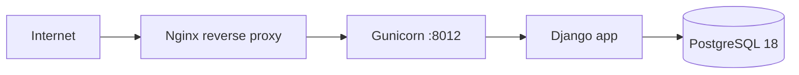
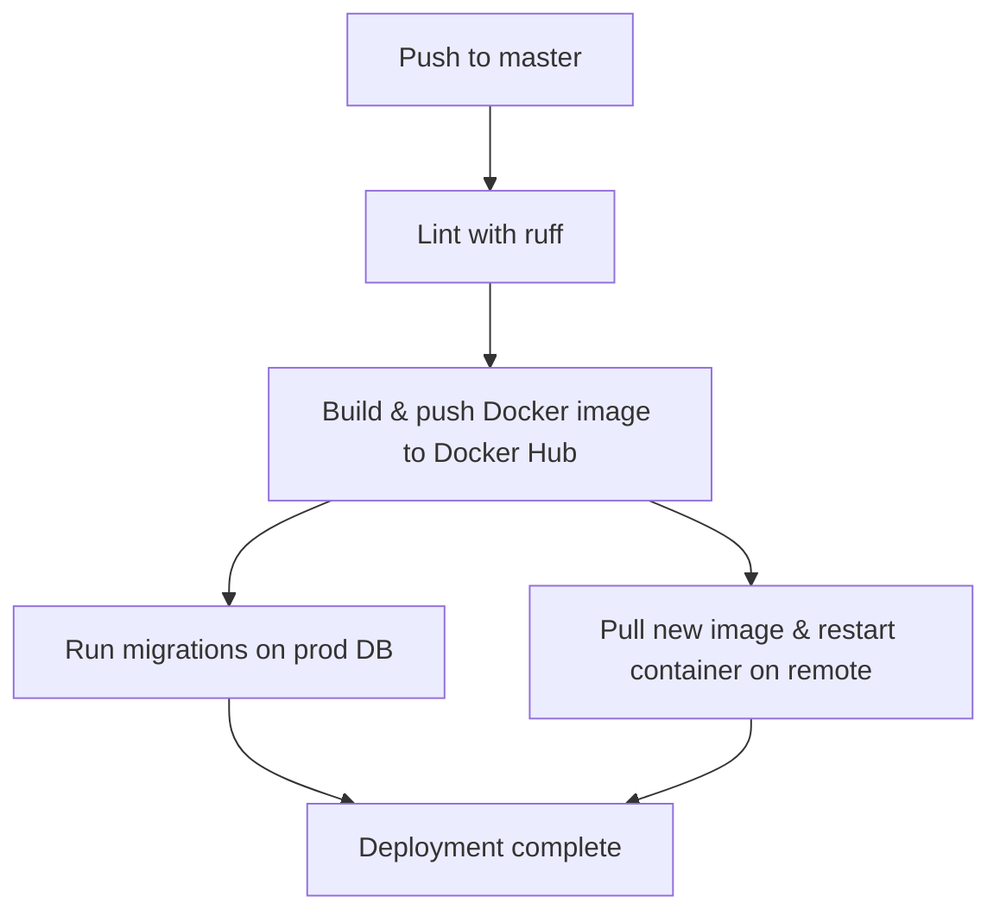

# Deployment

## Production architecture



The production setup runs on a single server:

- **Nginx** — reverse proxy, serves static files, terminates TLS
- **Gunicorn** — WSGI server on port 8012, running inside a Docker container
- **PostgreSQL 18** — managed separately on the server
- **Docker** — the app runs as a container from the `blablatdinov/test-radar` image

## Docker image

The production Dockerfile uses a multi-stage build:

1. **uv-export** — exports production dependencies to `requirements.txt` (no dev deps)
2. **build** — creates a virtualenv and installs dependencies
3. **runtime** — copies the venv and source, compiles translations, collects static files

```bash
docker build . -t blablatdinov/test-radar:<tag>
```

The image runs Gunicorn:

```bash
.venv/bin/gunicorn server.wsgi:application -b 0.0.0.0:8012
```

## CI/CD pipeline

Deployment is automated via GitHub Actions (`.github/workflows/deploy.yml`). On push to `master`:



1. **Checks** — ruff lint must pass
2. **Build & push** — Docker image tagged with the commit SHA, pushed to Docker Hub
3. **Migrations** — SSH to the server, run `manage.py migrate` against the production database
4. **Deploy** — SSH to the server, `docker compose down && up -d` with the new image tag, clean up old images

### Required secrets

| Secret | Purpose |
|--------|---------|
| `DOCKERHUB_USERNAME` | Docker Hub username for image push |
| `DOCKERHUB_TOKEN` | Docker Hub access token |
| `SSH_KEY` | SSH private key for the remote server |
| `PROD_DATABASE_URL` | Production database connection string |

## Production environment

The server runs `deploy/docker-compose.prod.yml`:

```yaml
services:
  test-radar-http:
    image: blablatdinov/test-radar:${TAG_NAME}
    command: .venv/bin/gunicorn server.wsgi:application -b 0.0.0.0:8012
    restart: always
    ports:
      - 8012:8012
    env_file:
      - .env
    environment:
      - APP_VERSION=${TAG_NAME}
```

The `.env` file on the server must contain all variables from `.env.example` with production values:

- `DEBUG=False`
- `SECRET_KEY` set to a strong value
- `ALLOWED_HOSTS` set to the production domain
- `DATABASE_URL` pointing to the production PostgreSQL
- `CSRF_TRUSTED_ORIGINS` set to the production domain
- `RBAC_ENABLED` set as needed
- `REGISTRATION_ENABLED` set as needed
- `BREVO_API_KEY` set for email
- `ADMIN_SECRET_PATH` set to obscure the admin URL

## Nginx configuration

The Nginx config (`deploy/test_radar_nginx.conf`) proxies requests to Gunicorn on port 8012 and serves static files directly. The Nginx config deployment step is currently commented out in the CI pipeline and applied manually.

## Manual operations

Using the Taskfile for prod operations:

```bash
# View prod logs
TAG_NAME=<tag> task compose-prod-logs

# Restart prod container
TAG_NAME=<tag> task compose-prod-restart

# Shell into prod container
TAG_NAME=<tag> task compose-prod-bash

# Rebuild and restart prod
task compose-prod-rebuild
```

## CI workflows

| Workflow | Trigger | Purpose |
|----------|---------|---------|
| `django.yml` | Push/PR | Lint, type check, test (PostgreSQL 18), translation check, collectstatic, deltaver |
| `deploy.yml` | Push to master | Build, push, migrate, deploy |
| `changes-tested.yml` | PR | Reject PRs with code changes but no test changes |
