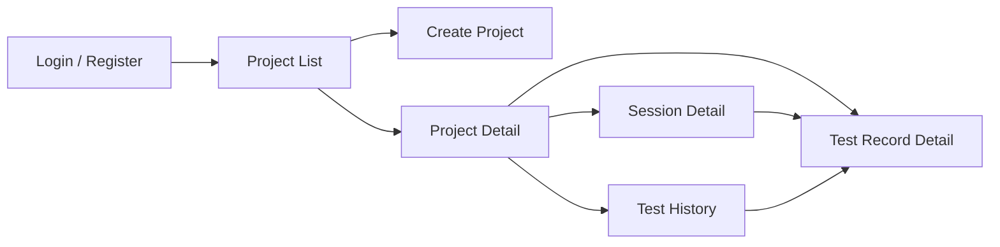

# User Guide (for developers)

This guide describes the Test Radar web interface from a developer's perspective. It explains what each feature does and how the UI components interact, so contributors can understand the product they are building.

## Pages and navigation

### Project list (index)

The landing page after login. Shows all projects the user owns or is a member of (depending on `RBAC_ENABLED`). Each project card links to the project detail page.

### Create project

A form with a single `name` field. On creation, the user becomes the project owner. If RBAC is enabled, a Membership record with the Owner role is also created.

### Project detail

The main page. Contains four sections:

#### 1. Filters

A form at the top of the page that narrows the matrix:

| Filter | Parameter | Effect |
|--------|-----------|--------|
| Date from | `datetime_from` | Only show records with `timestamp >=` this value |
| Date to | `datetime_to` | Only show records with `timestamp <=` this value |
| Agent | `agent` | Only show records from this agent |
| Branch | `branch` | Case-insensitive match on session branch |
| Session | `session` | Only show records from this session UUID |

Filters are applied server-side in `records/srv/record.py:filtered_records()`.

#### 2. Pass/fail matrix

The central feature. A table where:

- **Rows** — unique test labels, sorted alphabetically
- **Columns** — test sessions, ordered by timestamp
- **Cells** — green checkmark (pass) or red cross (fail), linking to the test record detail

The matrix is built server-side by `_build_matrix()` in `record.py`. Column headers show session date and time. The table has sticky headers for navigation with many sessions.

Each cell carries `data-success` and `data-commit` attributes used by `flaky.js` for client-side flaky detection.

#### 3. Agents table

Lists all agents for the project. For each agent:

- Name and type (CI / Local)
- Token mask (e.g. `ci_abc...xyz`)
- Actions: regenerate token, delete agent

Creating an agent generates a new API token. The full token is shown **once** in a Django messages flash, then only the mask is visible thereafter.

Permission rules (when RBAC is enabled):
- CI agents — Owner or Maintainer can create/delete
- Local agents — any project member can create; owner or the agent's owner can delete

#### 4. Members section (RBAC only)

Visible only when `RBAC_ENABLED=True`. Shows project members with their roles. The Owner can add members by username or email and remove members (except themselves).

### Session detail

URL: `/session/<uuid:session_id>`

Shows all test records within a single test session. Columns: test label, status, timestamp, branch, commit hash, agent. Each row links to the test record detail.

### Test record detail

URL: `/test/<hex_pk>`

Shows a single test record with its full decompressed logs. Logs are stored compressed (zstd) in the database and decompressed via the `decompressed_logs` model property. The `line_break` template filter inserts zero-width spaces after underscores in the test label for better word wrapping.

### Test history

URL: `/project/<uuid:guid>/test-history`

Shows all runs of a specific test label across all sessions. Useful for tracking whether a test has been consistently failing or recently started flaking.

## Flaky test detection

Flaky detection runs entirely client-side in `static/js/flaky.js` on `DOMContentLoaded`. A test label is marked flaky if **either** condition is true:

### Condition 1: Same-commit inconsistency

The same commit hash produced different outcomes (pass in one run, fail in another) for the same test label. This is the strongest signal — if the code is identical, the test result should be deterministic.

### Condition 2: Transition rate heuristic

All of the following must hold:
- At least 5 runs of the label
- At least one pass and one fail (not all-pass or all-fail)
- Transition rate >= 0.4 (proportion of adjacent runs that differ)
- Failure ratio between 0.15 and 0.85 (not too rare, not too frequent)

When a label is detected as flaky, a "flaky" badge is shown next to the label in the matrix.

## Dark mode

The UI supports dark mode via Tailwind CSS v4. A toggle button in the header persists the preference in `localStorage` and respects `prefers-color-scheme` on first visit.

## Internationalization

All user-facing strings use `gettext_lazy` (`_`). The project supports English (default) and Russian. Language .po files are in `src/locale/{en,ru}/LC_MESSAGES/django.po`. CI enforces that translations are up to date by running `makemessages` and checking `git diff --exit-code`.
